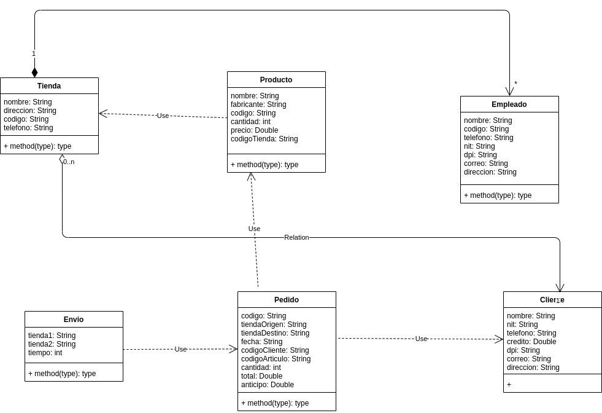

## MANUAL TECNICO
### Requerimientos de la aplicación

> Procesador: Intel(R) Core(TM) i5-9300H CPU @ 2.40GHz 2.40GHz
> RAM: 8,00 GB
> Sistema Operativo: de 64 bits

### DIAGRAMA DE CLASES

### DIAGRAMA ENTIDAD RELACION

